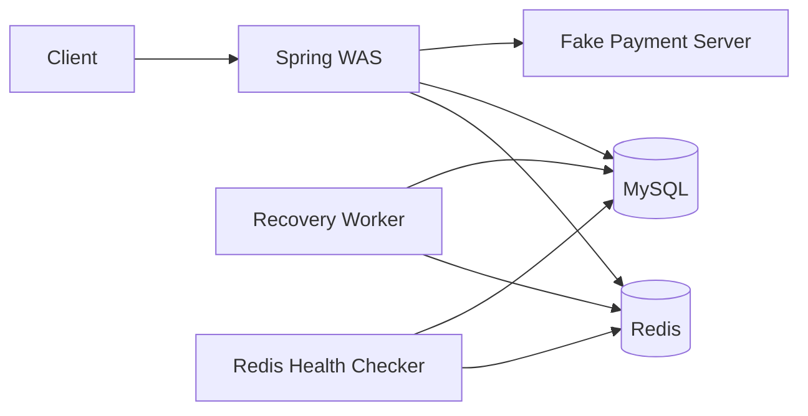
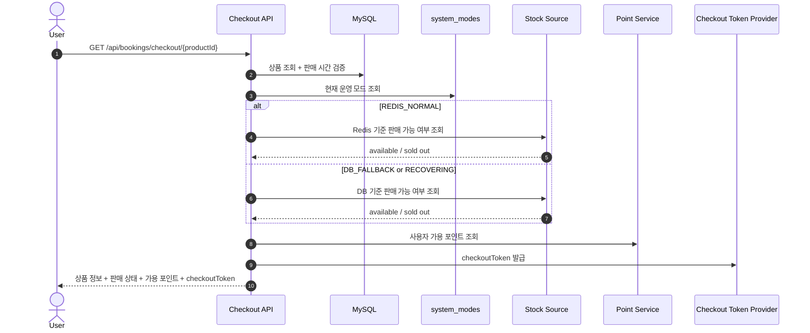
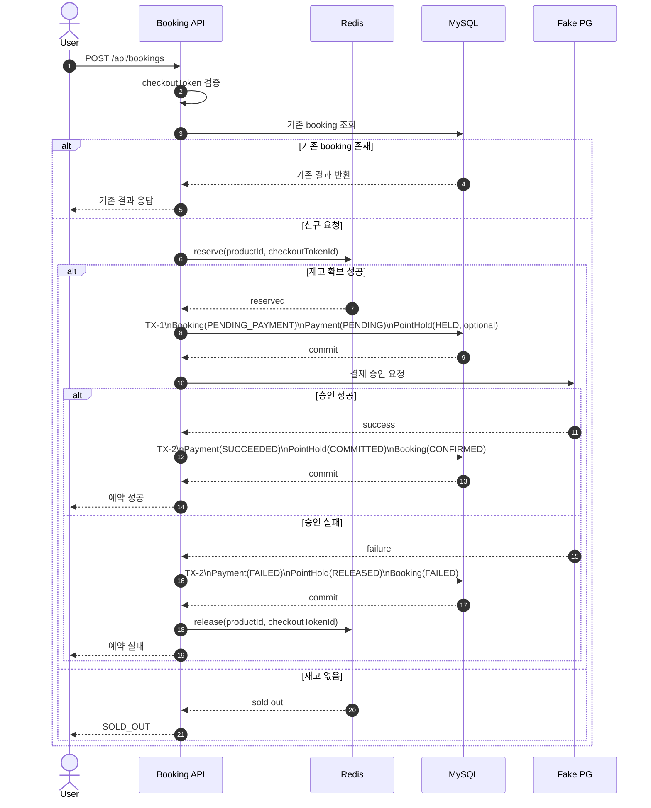
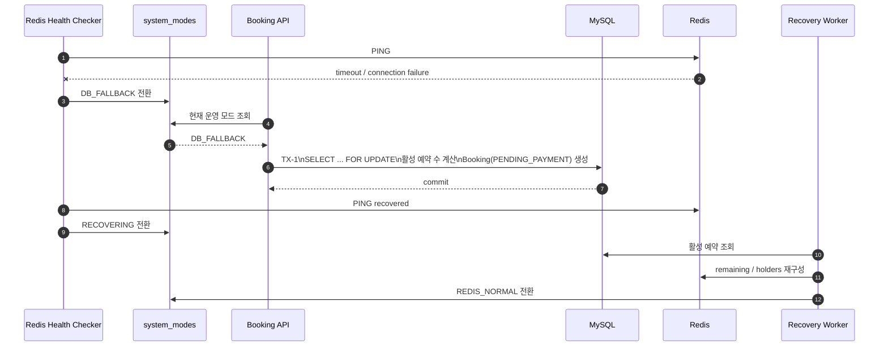
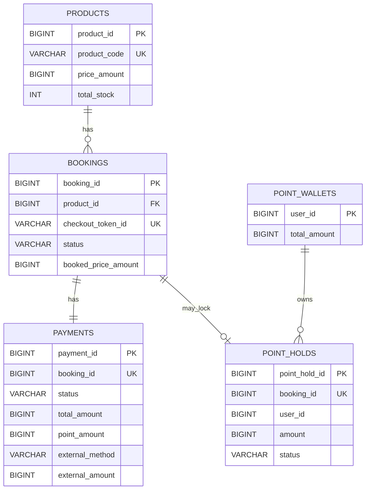

# stay-booking

00시 오픈 시점에 선착순으로 판매되는 한정 숙소 상품을 위한 예약/결제 시스템입니다.

이 프로젝트는 아래 4가지를 핵심 목표로 설계했습니다.

- 10개 한정 상품에 대해 초과판매 없이 정확히 10건만 판매할 것
- 중복 클릭, 재전송, 재시도 상황에서도 같은 요청은 한 번만 처리할 것
- Redis 장애 시에도 판매를 중단하지 않고 DB fallback 경로로 계속 처리할 것
- 결제 실패나 서버 중단 이후에도 재고, 예약, 포인트 상태를 복구 가능하게 만들 것

핵심 정책은 아래와 같습니다.

- `GET Checkout`은 재고를 점유하지 않습니다.
- `POST Booking`만 재고를 점유합니다.
- `PENDING_PAYMENT`는 이미 재고 1개를 확보한 상태를 의미합니다.
- 품절 판단 기준은 `PENDING_PAYMENT + CONFIRMED = total_stock` 입니다.
- 정상 경로의 실시간 재고 할당은 Redis가 담당합니다.
- 영속 기록과 장애 복구 기준 데이터는 MySQL이 담당합니다.
- 같은 `checkoutToken` 요청은 한 번만 처리하고, 이후에는 같은 결과를 반환합니다.

자세한 판단 근거와 트레이드오프는 `DECISIONS.md`에 정리했습니다.

## 1. 실행 방법

### 1.1 전체 실행

```bash
docker compose up -d --build
```

기동되는 구성요소는 아래와 같습니다.

- `stay-booking-app`: Spring Boot API 서버
- `stay-booking-mysql`: 예약/결제/포인트/운영 모드 저장소
- `stay-booking-redis`: 실시간 재고 저장소
- `stay-booking-pg-fake`: 외부 결제 서버를 대체하는 fake server
- `stay-booking-db-seed`: 샘플 상품/포인트 데이터 적재

기본 포트:

- API: `http://localhost:8080`
- MySQL: `localhost:3306`
- Redis: `localhost:6379`
- Fake Payment Server: `http://localhost:8081`

샘플 데이터:

- 상품: `productId = 1`
- 상품가: `120000`
- 총 재고: `10`
- 포인트 지갑: `userId = 1`, `50000`

### 1.2 테스트 실행

```bash
./gradlew test
```

## 2. 시스템 아키텍처



구성요소 역할:

- `Spring WAS`
  - 주문서 조회, 예약 생성, 결제 실행, 멱등성 처리
- `Redis`
  - 정상 경로의 재고 확보/반납
  - `remaining` 수량과 `checkoutTokenId` 기반 holder 관리
- `MySQL`
  - 예약, 결제, 포인트, 운영 모드의 영속 저장소
  - Redis 장애 시 fallback 재고 판단 기준
- `Fake Payment Server`
  - 외부 결제 성공/실패/장애 상황을 재현하는 테스트용 서버
- `Recovery Worker`
  - orphan stock 정리
  - 오래된 `PENDING_PAYMENT` 정리
  - Redis 재동기화 수행

## 3. 핵심 처리 흐름

### 3.1 Checkout 흐름



- `Checkout`은 재고를 점유하지 않고, 현재 판매 가능 여부만 조회합니다.
- 운영 모드에 따라 판매 가능 여부 판단 기준이 Redis 또는 DB로 달라집니다.
- 여기서 발급한 `checkoutToken`은 이후 `POST Booking`의 멱등성 키로 사용됩니다.

### 3.2 Booking 처리 흐름



- 재고 확보 성공 이후에만 `PENDING_PAYMENT` 예약을 생성합니다.
- 같은 `checkoutToken`은 Redis holder와 DB unique key로 이중 보호합니다.
- 결제 실패 시 `Booking FAILED`, `PointHold RELEASED`, Redis 재고 반납이 함께 일어납니다.

### 3.3 Redis 장애 전환 및 복구 흐름



- Redis 장애와 정상 품절을 구분합니다.
- 장애 시에는 전 서버가 동일하게 DB 경로를 사용합니다.
- Redis 복구 직후에도 바로 정상 복귀하지 않고, DB 기준 재동기화 후에만 `REDIS_NORMAL`로 돌아갑니다.

## 4. API 개요

모든 API는 사용자 식별을 위해 `X-USER-ID` 헤더를 사용합니다.

| API | 설명 |
|---|---|
| `GET /api/bookings/checkout/{productId}` | 상품 정보, 판매 상태, 가용 포인트 조회 및 `checkoutToken` 발급 |
| `POST /api/bookings` | 재고 확보, 결제 수행, 예약 생성/확정을 동기 처리 |

## 5. 주문/결제 도메인 데이터 모델



핵심 모델링 포인트:

- `bookings.checkout_token_id` 에 `UNIQUE` 제약을 두어 영속 멱등성을 보장합니다.
- DB는 `current_stock` 컬럼을 두지 않고, 활성 예약 수로 남은 재고를 계산합니다.
- 활성 예약 수는 `PENDING_PAYMENT + CONFIRMED` 입니다.
- Redis 장애 시 `product_id + status` 인덱스로 활성 예약 수를 빠르게 집계합니다.

DDL은 `src/main/resources/db/migration/V1__init_domain_schema.sql` 에 있습니다.

## 6. 운영 모드와 복구 워커

### 운영 모드

현재 운영 모드는 아래 3가지를 사용합니다.

- `REDIS_NORMAL`
  - Redis 기준 정상 판매 경로
- `DB_FALLBACK`
  - Redis를 신뢰할 수 없을 때 DB 기준 판매 경로
- `RECOVERING`
  - Redis 재동기화 중인 경로

### 복구 워커

복구 워커는 `@Scheduled` 기반으로 동작합니다.

- orphan stock allocation 복구
- 오래된 `PENDING_PAYMENT` 정리
- Redis resync

자세한 판단 근거와 트레이드오프는 `DECISIONS.md`에 정리했습니다.

## 7. 테스트 및 검증

테스트는 정상 흐름 확인보다, 정합성이 깨지기 쉬운 시나리오를 우선 검증했습니다.

테스트 도구:

- JUnit 5
- Spring Boot Test
- Testcontainers (MySQL, Redis)
- MockWebServer

주요 검증 범위:

| 검증 대상 | 확인 내용 |
|---|---|
| 동시성 | 1000건 동시 요청에서 정확히 10건만 성공하는지 |
| 멱등성 | 같은 `checkoutToken` 요청이 한 번만 처리되는지 |
| 결제 실패 보상 | 실패 시 예약/결제/포인트/재고가 함께 정리되는지 |
| Redis fallback | Redis 장애 시 DB 경로로 계속 예약 가능한지 |
| orphan stock 복구 | 재고만 차감되고 booking이 없는 holder를 복구하는지 |
| pending timeout 복구 | 오래된 `PENDING_PAYMENT`를 실패 처리하고 자원을 회수하는지 |
| Redis 재동기화 | `RECOVERING` 모드에서 Redis 재고와 holder를 DB 기준으로 다시 맞추는지 |

특히 통합 테스트에서는 아래 시나리오를 직접 검증했습니다.

- 1000건 동시 요청 시 10건만 성공
- 동일 `checkoutToken` 동시 요청 시 booking/payment 1건만 생성
- 결제 실패 시 `Booking FAILED`, `PointHold RELEASED`, Redis 재고 복구
- Redis 장애 시 DB fallback 처리
- 복구 워커를 통한 orphan stock / timed-out pending 정리
- Redis 재동기화 후 `REDIS_NORMAL` 복귀
